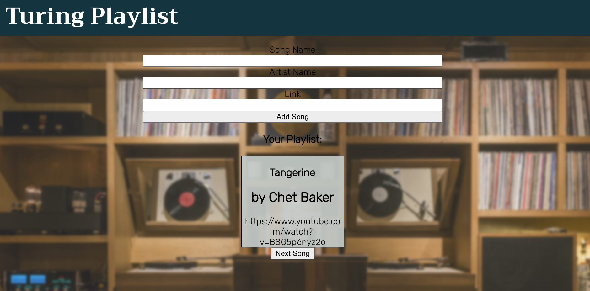

## Turing Playlist - Music Management App

This application was built with `create-react-app`.

### Set Up

Clone down this repo.

On GitHub, create a new, empty repository and name it something like 'turing-playlist-fe'.

By the end of the assessment, update the current remote (origin) and point it at the new URL of the repository you just created on GitHub. You can read how to do this [here](https://help.github.com/en/articles/changing-a-remotes-url). Once you've updated the remote, you should be able to push up to that repo after you have at least one commit.

Run `npm install` to install dependencies for the repo.

Run `npm start` to start up your React server.

### Expectations / Rules

Build a React app that can keep track of a queue of music!

You will have 3 hours to build this application.

**Note:** This is a basic example of the important pieces of the app. Yours DOES NOT need to look exactly like this.

We do want to see good commit habits - atomic commits that log small, focused changesets. Don't worry about creating GitHub issues, though.

### Iteration 0

Pull down the [API repo](https://github.com/turingschool-examples/turing-playlist-api). Set up instructions are in that repository's README.

Do *not* nest this inside your front-end repository.

### Iteration 1

Get all existing songs on page load and display them on the DOM.

### Iteration 2

Create a controlled form component to add a new song to the queue (look into the API documentation to see what pieces of information are expected, and what datatypes it wants each piece to be). As a user types into the input fields, the form component's state should change.  When the user clicks the `Add Song` button, the application should update the App's state.  The new song should display with all of the existing songs. 

Do not worry about making the POST request to the database yet.

### Iteration 3

Now that the functionality is there for adding a reservation, write some tests:
* Write tests for the form component and another component (not App yet) covering what should be displayed on the page.
* Write a unit test for the form component that checks that when data is put into the form, the value is reflected in that form input.
* Write an integration test for App that tests the user flow for adding a new song.

### Iteration 4 (extension)

When the user adds a song, the application should make a post request to the API. The new song should still exist upon reloading the page.

**Keep any fetch calls you write in the App component for now**

(If you have time to refactor your fetch calls into a separate helper file, that is fine, but it is *NOT* a requirement for this application.)

### Iteration 5 (extension)

Delete the first song in the queue when the user clicks on the `Next Song` button.  The deletion should persist upon reloading the page.

### Other Extensions

* Now try mocking your API calls. Try writing out a few other integration tests including happy path and sad path testing.
